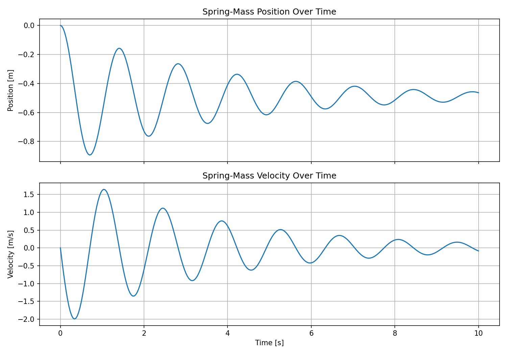
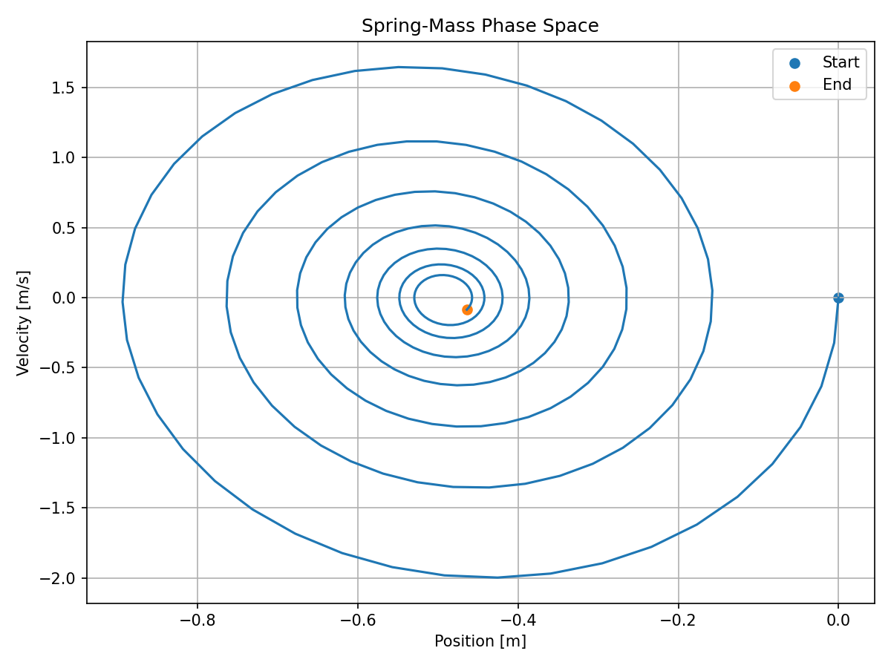
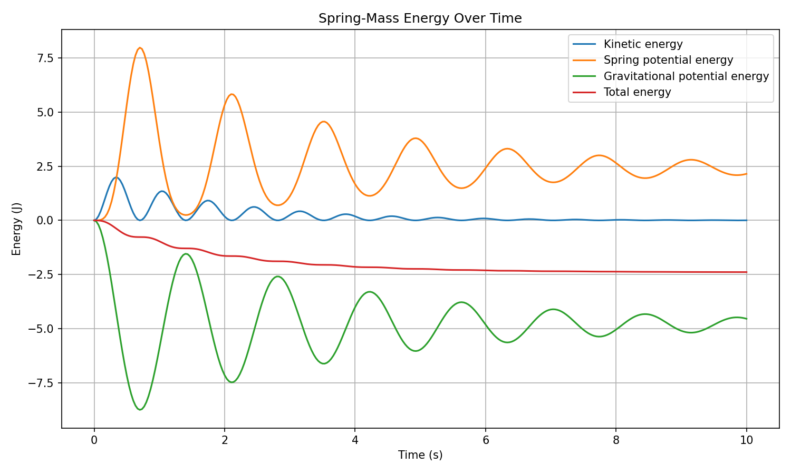

# Interactive Physics Simulations

A collection of physics simulations and visualisations built with Python.

This project explores numerical methods, classical mechanics, chaos, and scientific visualisation through clean, reusable simulation code.

## Current Simulation

### Spring-Mass Oscillator

A damped spring-mass system modelled as a second-order ordinary differential equation and solved numerically.

The current implementation simulates the motion of a mass attached to a spring, prints a short summary of the result to the console, and generates visualisations for the system.

Current console output includes:

- Number of simulation frames
- Final position
- Final velocity
- Equilibrium position
- Generated visualisations

#### Example Output

```bash
Spring-mass simulation complete.
Frames: 301
Final position: -0.4640 m
Final velocity: -0.0854 m/s
Equilibrium position: -0.4900 m

Generated visualisations:
- assets/spring_mass/time_domain.png
- assets/spring_mass/phase_space.png
- assets/spring_mass/energy.png
```

## Current Visualisations

The spring-mass oscillator currently generates the following visualisations.

These are different views of the same spring-mass simulation, not separate simulations.

| Visualisation | Preview | Description |
|---|---|---|
| Time-domain response |  | Shows position and velocity over time |
| Phase-space diagram |  | Shows the relationship between position and velocity |
| Energy over time |  | Shows kinetic, potential, and total energy |

## Planned Simulations

- Double pendulum
- Lorenz attractor
- N-body gravity simulation
- Wave equation visualisation
- Heat equation visualisation

## Project Goals

The goal of this repository is to build a polished collection of simulations that demonstrate:

- Scientific computing
- Numerical methods
- Physics modelling
- Data visualisation
- Clean Python project structure
- Testing and documentation

## Installation

Clone the repository:

```bash
git clone https://github.com/sahilneela/simulations.git
cd simulations
```

Create and activate a virtual environment:

```bash
python -m venv .venv
source .venv/bin/activate
```

Install the project:

```bash
pip install -e ".[dev]"
```

## Usage

Run the spring-mass demo:

```bash
python examples/spring_mass_demo.py
```

This will run the simulation and generate visual outputs in:

```txt
assets/spring_mass/
```

## License

MIT License.
